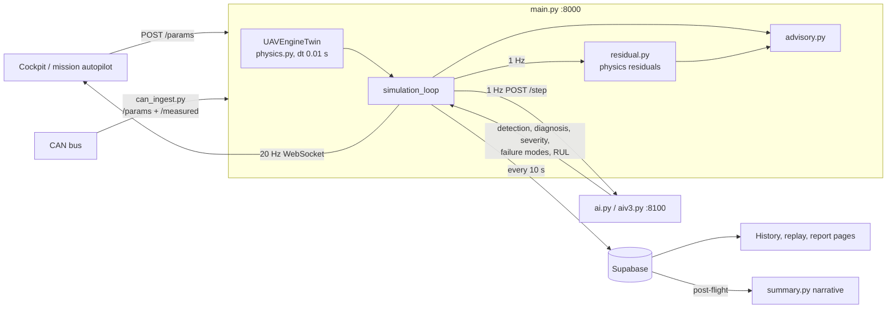
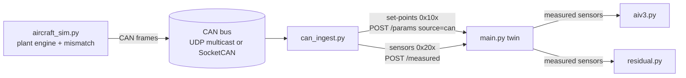

# AERO-SIM architecture

Digital twin and predictive-maintenance system for Rotax 912 / 914 / 915 / 916 UAV engines
(DRDO problem statement 26054).

## Services

| Process | Port | Runtime | Role |
|---|---|---|---|
| `frontend/` (Next.js) | 3000 | Node | Cockpit, telemetry history, mission replay and reports |
| `backend/main.py` (FastAPI) | 8000 | `backend/.venv` | Physics twin loop at 100 Hz, WebSocket telemetry, persistence, advisory |
| `backend/ai.py` **or** `backend/aiv3.py` (FastAPI) | 8100 | `validation/venv` (TensorFlow + Metal) | Neural inference on a rolling 128-second window |
| Supabase | — | hosted Postgres | Runs, per-10 s telemetry, per-channel diagnostics, auth |
| `backend/can_ingest.py` | — | `backend/.venv` (+ optional `python-can`) | CAN bridge: set-point frames to `/params`, sensor frames to `/measured` |
| `backend/aircraft_sim.py` | — | `backend/.venv` | The simulated aircraft: its own engine, optional mismatch, CAN frames only |

Only one AI service runs at a time; both bind 8100 and expose the same endpoints
(`/step`, `/reset`, `/select_engine`, `/health`).

## Data flow



- Physics integrates at 100 Hz; the AI and the residual monitor are fed one sample per
  simulated second, because every model was trained on 1-second samples.
- While the AI buffer fills (128 s), the loop fast-forwards without real-time sleeps and
  calls the AI sequentially so samples cannot arrive out of order - except while the aircraft
  is on the CAN bus, which streams in real time.

## Aircraft over CAN (plant and twin split)

The twin must not share memory with the engine it monitors. In CAN mode three processes
replace the cockpit sliders:



- `backend/can_bus.py` is the contract: frame IDs, scaling, ranges and transports. Frames are
  SocketCAN `struct can_frame` bytes, so the laptop's UDP multicast bus and a real bus
  (`--bus socketcan:can0`, any python-can interface) carry identical payloads.
- `main.py /measured` bounds every value to the sensor range; while readings are fresh (< 1 s)
  they replace the twin's sensor channels (`data_source: "can"`, twin values kept as
  `twin_sensors`). The twin's physics keeps following the set-points, so the residuals compare
  the real engine against physics, and the AI scores the real engine.
- While the aircraft is on the bus it owns the set-points: untagged `/params` (the cockpit) are
  ignored. A switch between simulated and measured data restarts the AI window and the residual
  lag states, and warm-up runs in real time.
- `validation/mismatch_eval.py` flies a deliberately different plant (calibration offsets, unit
  spread, noisy sensors, a drifting sensor, v2 physics) against the twin and scores false alarms,
  health, RUL and drift detection.
- Telemetry is broadcast at 20 Hz with the latest AI result, the residuals and the advisory
  attached; a telemetry row is written every 10 simulated seconds.

## Physics generations

`physics.py` carries two calibrations behind one switch, so the live demo never changes
underneath a model:

| | v2 (default) | v3 (opt-in) |
|---|---|---|
| Thermal model | mis-calibrated, CHT clipped at 260 C in 99.8% of rows | real Rotax bands (CHT ~100-150 C) |
| Wear | invisible to sensors | moves oil pressure, CHT, EGT, oil temp, vibration, BSFC, torque |
| Engine failure modes | none | misfire, injector fouling, cooling degradation, combustion instability |
| RUL label | seconds to failure within one flight, censored | engine hours remaining against TBO |
| Models | `backend/models/` via `ai.py` | `backend/models_v3/` via `aiv3.py` |
| Persistence | `db.py` | `dbv3.py` |

v2 is kept bit-identical (verified to 0.0 across 21 channels, 3000 steps, 4 engines).

Switching to v3:

```bash
cd backend && ../validation/venv/bin/uvicorn aiv3:app --host 127.0.0.1 --port 8100
cd backend && AERO_PHYSICS_VERSION=v3 uvicorn main:app --host 0.0.0.0 --port 8000
```

`GET /state` reports `physics_version` and `ai_model_version`; main.py warns when they differ,
and `/resume` refuses to continue a run recorded under the other version.

## Model contract (v3)

`validation/tf_data_pipeline.py` is the specification. `aiv3.py` copies it and checks it at
startup against each engine's `manifest.json`.

- Input window: 128 x 25 features, scaled with a `StandardScaler` fit on the train split only.
- Auxiliary RUL inputs (10): running/max/recent severity, severity trend, elapsed hours,
  high-throttle fraction, and four degradation residuals (oil-pressure ratio, vibration ratio,
  BSFC ratio, CHT excess).
- Five heads per engine, each exported from the training phase where it scored best on the test
  split (`validation/split_deployable_heads.py`): detection (phase 1), diagnosis (phase 2),
  severity (phase 3), failure modes (phase 4), RUL (phase 5).
- `validation/parity_ai_v3.py` feeds real test scenarios through the live incremental window and
  requires the inputs and all five predictions to match the batch pipeline.

Rules that have each caused an incident: always `.predict()`, never `model(x)`; serve from the
Metal environment (`validation/venv`); `SEVERITY_POWER_DIVISOR` stays 85.0 for every engine.

## Physics residuals (`backend/residual.py`)

`residual = measured - physics_expected(throttle, rpm, power, airspeed, ambient, wear)`.

- No model and no network: runs onboard and keeps working while the AI is down.
- Estimates a wear-like degradation index from the channel groups that currently agree with
  physics; a group stops voting while its channels deviate or saturate, and the index moves at
  most 0.002 per second, so simultaneous sensor faults cannot drag it.
- Classifies each disagreeing channel as bias, drift, noise, spike or stuck, and reports readings
  pinned at a sensor range limit as saturated.
- `advisory.py` attributes a deviation to an active engine failure mode where the physics says that
  mode moves the channel, and otherwise raises a suspected-sensor item.

## Advisory (`backend/advisory.py`)

Deterministic rules over the AI result, the telemetry and the residuals: per-channel faults,
engine failure modes, composite health, RUL (engine hours for v3), residual sensor integrity,
residual-implied wear, conventional limit checks and the training-envelope check. No LLM on the
live path; the Groq narrative (`summary.py`) is post-flight only.

## Database

| Table | Notes |
|---|---|
| `simulations` | one row per run; `model_version` (`v2` legacy default, `v3`), `tbo_hours`, final health/RUL, final telemetry snapshot, Groq summary |
| `telemetry_logs` | every 10 s; v3 adds `degradation_index`, `failure_modes`, `residual_deviations` |
| `channel_diagnostics` | per sensor channel per logged row |

The frontend decides every RUL and flight-time conversion through `lib/timeScale.ts`
(`modelVersionOf`, `rulPercentOf`, `flightHours`) and labels legacy runs with `ModelBadge`.

## Training and validation (`validation/`, not in git)

Dataset v3: 10 M rows per engine, life-stage sampled, 80/10/10 split by scenario. Phases 1-5 are
run per engine by `validation/run.py` or the per-engine notebooks; see `docs/model_cards.md` for
measured results and `docs/deployment_roadmap.md` for what remains.
